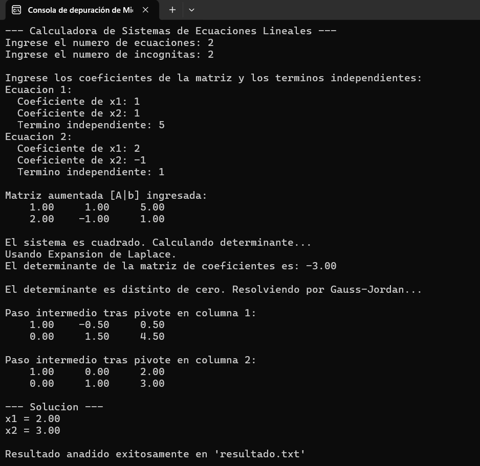
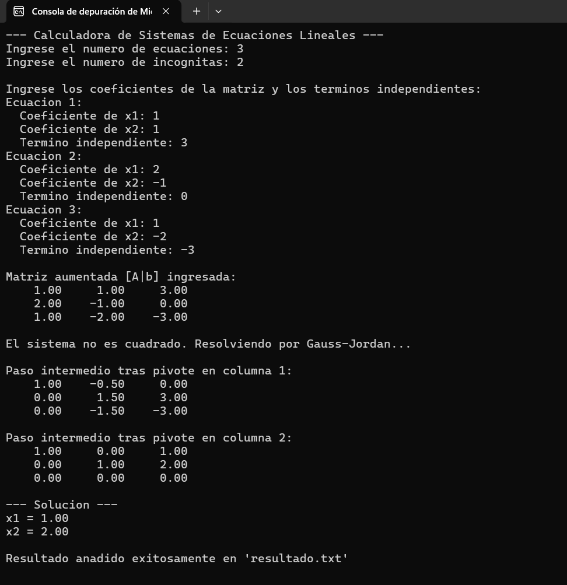
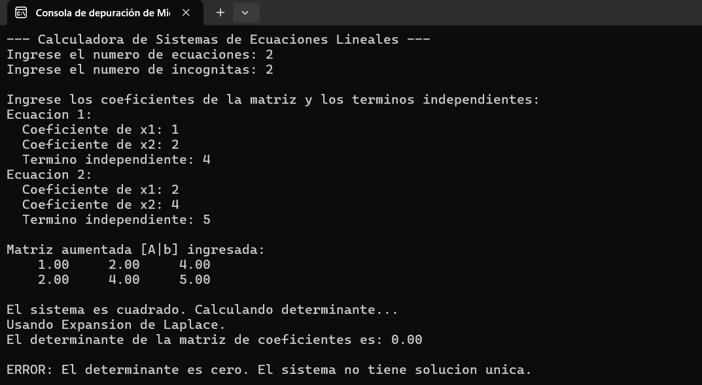

**Calculadora de Sistemas de Ecuaciones Lineales** \
Proyecto desarrollado para la materia Programación 2 de la carrera de Ingeniería en Informática. El objetivo de este trabajo es aplicar los conceptos fundamentales de la programación en C++, como la modularidad, la recursividad y el manejo de archivos, para crear una herramienta robusta capaz de resolver sistemas de ecuaciones lineales de distintos tamaños.

Integrantes del Grupo \
Abril Teo \
Lavezzari Fabricio \
Martos Felipe

**Características Principales** \
El programa cuenta con las siguientes funcionalidades:

Resolución de Sistemas Cuadrados y Rectangulares: Capaz de manejar sistemas donde el número de ecuaciones y de incógnitas es igual o diferente.

Selección Automática de Método: El programa analiza las dimensiones de la matriz ingresada y elige el método más eficiente para el cálculo del determinante:

Fórmula estándar para matrices de 2x2.

Regla de Sarrus para matrices de 3x3.

Expansión de Laplace (Recursiva) para matrices de orden superior.

Reducción por Gauss-Jordan: Es el método principal utilizado para encontrar la solución del sistema, robusto incluso para casos no cuadrados.

Detección de Sistemas sin Solución: El programa es capaz de identificar sistemas inconsistentes (sin solución) o con infinitas soluciones (determinante cero).

Persistencia de Resultados: Cada solución calculada se guarda en un archivo de historial llamado resultado.txt, conservando las ejecuciones anteriores.

Código Modular: El proyecto está organizado en módulos (.h y .cpp) para separar responsabilidades (entrada/salida, operaciones de matrices, resolución, etc.), siguiendo las buenas prácticas de la programación.

**Casos de Prueba** \
A continuación, se muestran tres ejecuciones del programa que demuestran su correcto funcionamiento en distintos escenarios.

Caso 1: Sistema 2x2 con Solución Única
Esta prueba verifica la correcta resolución de un sistema cuadrado simple y el cálculo de su determinante. \

Caso 2: Sistema 3x2 Rectangular
Esta prueba demuestra la capacidad del algoritmo de Gauss-Jordan para manejar sistemas no cuadrados y encontrar la solución correcta.

Caso 3: Sistema Inconsistente (Sin Solución)
Esta prueba confirma que el programa es capaz de identificar sistemas que no tienen solución, en este caso, a través del cálculo de un determinante igual a cero.
